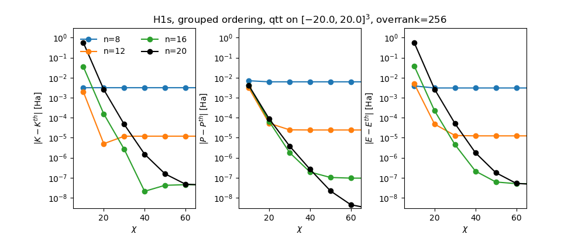

# Tensorised Orbitals

QTT toolbox including shift and laplacian MPO's as well as `mps_mps`, `mps_mpo_mps`, `mps_mps_mps` contractions.
Built in LSB first grouped ordering, i.e. $x_1 ... x_n y_1...y_n z_1...z_n$.

The included [example.py](example.py) script calculates using a patched [xfacpy](https://github.com/elv3rs/xfac.git) TCI library the $E=T+V$ for the analytical hydrogen 1s orbital and reproduces Figure 1 of [Tensorized orbitals for computational chemistry (Phys. Rev. B, 2025)](https://arxiv.org/abs/2308.03508v3).

Installation is detailed in `install.sh` and tested on a pristine Ubuntu 26.04 VM.

Example program output follows.


```
n = 8
x  |K-K^th| |P-P^th| |E-E^th|
10 3.15e-03 7.03e-03 3.88e-03
20 3.15e-03 6.21e-03 3.06e-03
30 3.15e-03 6.21e-03 3.06e-03
40 3.15e-03 6.21e-03 3.06e-03
50 3.15e-03 6.21e-03 3.06e-03
60 3.15e-03 6.21e-03 3.06e-03
70 3.15e-03 6.21e-03 3.06e-03

n = 12
x  |K-K^th| |P-P^th| |E-E^th|
10 1.96e-03 3.07e-03 5.04e-03
20 5.04e-06 5.27e-05 4.77e-05
30 1.19e-05 2.48e-05 1.29e-05
40 1.19e-05 2.44e-05 1.24e-05
50 1.20e-05 2.43e-05 1.24e-05
60 1.20e-05 2.43e-05 1.24e-05
70 1.20e-05 2.43e-05 1.24e-05

n = 16
x  |K-K^th| |P-P^th| |E-E^th|
10 3.49e-02 4.10e-03 3.90e-02
20 1.56e-04 6.48e-05 2.21e-04
30 2.68e-06 1.81e-06 4.49e-06
40 2.11e-08 1.94e-07 2.15e-07
50 4.21e-08 1.04e-07 6.16e-08
60 4.51e-08 9.60e-08 5.09e-08
70 4.48e-08 9.54e-08 5.06e-08

n = 20
x  |K-K^th| |P-P^th| |E-E^th|
10 5.62e-01 4.13e-03 5.66e-01
20 2.55e-03 8.78e-05 2.64e-03
30 4.69e-05 3.84e-06 5.07e-05
40 1.51e-06 2.65e-07 1.77e-06
50 1.57e-07 2.21e-08 1.79e-07
60 4.79e-08 4.49e-09 5.24e-08
70 4.29e-08 2.85e-09 4.58e-08
```
